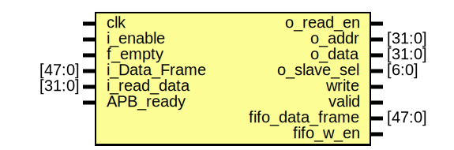
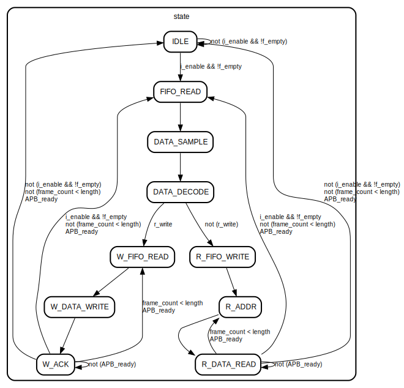

# Entity: ENCODEC 
- **File**: ENCODEC.v

## Diagram

## Ports

| Port name       | Direction | Type   | Description |
| --------------- | --------- | ------ | ----------- |
| clk             | input     |        |             |
| i_enable        | input     |        |             |
| f_empty         | input     |        |             |
| i_Data_Frame    | input     | [47:0] |             |
| o_read_en       | output    |        |             |
| i_read_data     | input     | [31:0] |             |
| APB_ready       | input     |        |             |
| o_addr          | output    | [31:0] |             |
| o_data          | output    | [31:0] |             |
| o_slave_sel     | output    | [6:0]  |             |
| write           | output    |        |             |
| valid           | output    |        |             |
| fifo_data_frame | output    | [47:0] |             |
| fifo_w_en       | output    |        |             |

## Signals

| Name              | Type       | Description |
| ----------------- | ---------- | ----------- |
| r_valid           | reg        |             |
| length            | reg [7:0]  |             |
| r_write           | reg        |             |
| r_slave_sel       | reg [6:0]  |             |
| r1_addr           | reg [31:0] |             |
| r2_addr           | reg [31:0] |             |
| r_data            | reg [31:0] |             |
| r_read_data       | reg [31:0] |             |
| r_data_frame      | reg [47:0] |             |
| r_read_en = 0     | reg        |             |
| frame_count = 0   | reg [7:0]  |             |
| r_fifo_data_frame | reg [47:0] |             |
| r_fifo_w_en       | reg        |             |
| state = 4'b0      | reg [4:0]  |             |

## Constants

| Name         | Type | Value   | Description |
| ------------ | ---- | ------- | ----------- |
| IDLE         |      | 4'b0000 |             |
| FIFO_READ    |      | 4'b0001 |             |
| DATA_SAMPLE  |      | 4'B0010 |             |
| DATA_DECODE  |      | 4'b0011 |             |
| W_FIFO_READ  |      | 4'b0100 |             |
| W_DATA_WRITE |      | 4'b0101 |             |
| W_ACK        |      | 4'b0110 |             |
| R_FIFO_WRITE |      | 4'b0111 |             |
| R_ADDR       |      | 4'b1000 |             |
| R_DATA_READ  |      | 4'b1001 |             |

## Processes
- unnamed: ( @(posedge clk) )
  - **Type:** always

## State machines

