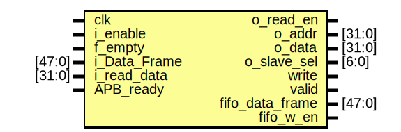

# ENCODEC_APB

Design modules information

# Entity: ENCODEC 
- **File**: ENCODEC.v

## Diagram

## Ports

| Port name       | Direction | Type   | Description |
| --------------- | --------- | ------ | ----------- |
| clk             | input     |        |             |
| i_enable        | input     |        |             |
| f_empty         | input     |        |             |
| i_Data_Frame    | input     | [47:0] |             |
| o_read_en       | output    |        |             |
| i_read_data     | input     | [31:0] |             |
| APB_ready       | input     |        |             |
| o_addr          | output    | [31:0] |             |
| o_data          | output    | [31:0] |             |
| o_slave_sel     | output    | [6:0]  |             |
| write           | output    |        |             |
| valid           | output    |        |             |
| fifo_data_frame | output    | [47:0] |             |
| fifo_w_en       | output    |        |             |

## Signals

| Name              | Type       | Description |
| ----------------- | ---------- | ----------- |
| r_valid           | reg        |             |
| length            | reg [7:0]  |             |
| r_write           | reg        |             |
| r_slave_sel       | reg [6:0]  |             |
| r1_addr           | reg [31:0] |             |
| r2_addr           | reg [31:0] |             |
| r_data            | reg [31:0] |             |
| r_read_data       | reg [31:0] |             |
| r_data_frame      | reg [47:0] |             |
| r_read_en = 0     | reg        |             |
| frame_count = 0   | reg [7:0]  |             |
| r_fifo_data_frame | reg [47:0] |             |
| r_fifo_w_en       | reg        |             |
| state = 4'b0      | reg [4:0]  |             |

## Constants

| Name         | Type | Value   | Description |
| ------------ | ---- | ------- | ----------- |
| IDLE         |      | 4'b0000 |             |
| FIFO_READ    |      | 4'b0001 |             |
| DATA_SAMPLE  |      | 4'B0010 |             |
| DATA_DECODE  |      | 4'b0011 |             |
| W_FIFO_READ  |      | 4'b0100 |             |
| W_DATA_WRITE |      | 4'b0101 |             |
| W_ACK        |      | 4'b0110 |             |
| R_FIFO_WRITE |      | 4'b0111 |             |
| R_ADDR       |      | 4'b1000 |             |
| R_DATA_READ  |      | 4'b1001 |             |

## Processes
- unnamed: ( @(posedge clk) )
  - **Type:** always

## State machines

# Entity: APB_Bridge 
- **File**: APB_Bridge.v

## Diagram

## Ports

| Port name         | Direction | Type  | Description |
| ----------------- | --------- | ----- | ----------- |
| apb_write_paddr   | input     | [8:0] |             |
| apb_read_paddr    | input     | [8:0] |             |
| apb_write_data    | input     | [7:0] |             |
| prdata            | input     | [7:0] |             |
| presetn           | input     |       |             |
| pclk              |           |       |             |
| read              |           |       |             |
| write             |           |       |             |
| transfer          |           |       |             |
| pready            | input     |       |             |
| psel0             | output    |       |             |
| psel1             |           |       |             |
| penable           | output    |       |             |
| paddr             | output    | [8:0] |             |
| pwrite            | output    |       |             |
| pwdata            | output    | [7:0] |             |
| apb_read_data_out | output    | [7:0] |             |
| pslverr           | output    |       |             |

## Signals

| Name                | Type      | Description |
| ------------------- | --------- | ----------- |
| present_state       | reg [1:0] |             |
| next_state          | reg [1:0] |             |
| invalid_setup_error | reg       |             |
| setup_error         | reg       |             |
| invalid_read_paddr  | reg       |             |
| invalid_write_paddr | reg       |             |
| invalid_write_data  | reg       |             |

## Constants

| Name   | Type | Value | Description |
| ------ | ---- | ----- | ----------- |
| idle   |      | 2'b00 |             |
| setup  |      | 2'b01 |             |
| access |      | 2'b10 |             |

## Processes
- unnamed: ( @(posedge pclk) )
  - **Type:** always
- unnamed: ( @(present_state, transfer, pready) )
  - **Type:** always
- unnamed: ( @(*) )
  - **Type:** always

## State machines

# Entity: APB_Slave 
- **File**: APB_Slave.v

## Diagram

## Ports

| Port name  | Direction | Type        | Description |
| ---------- | --------- | ----------- | ----------- |
| pclk       | input     |             |             |
| preset_n   | input     |             |             |
| psel       | input     | [6:0]       |             |
| penable    | input     |             |             |
| pwrite     | input     |             |             |
| paddr      | input     | wire[31:0]  |             |
| pwdata     | input     | wire[31:0]  |             |
| pwdata_out | output    | wire [31:0] |             |
| prdata_out | output    | wire [31:0] |             |
| dv         | output    |             |             |
| pready     | output    |             |             |

## Signals

| Name                  | Type       | Description |
| --------------------- | ---------- | ----------- |
| pready_counter = 8'b0 | reg [7:0]  |             |
| s_state = 2'b00       | reg [1:0]  |             |
| data_latch            | reg [31:0] |             |
| temp                  | reg [31:0] |             |

## Constants

| Name  | Type | Value | Description |
| ----- | ---- | ----- | ----------- |
| IDLE  |      | 2'b00 |             |
| WRITE |      | 2'b01 |             |
| READ  |      | 2'b10 |             |

## Processes
- unnamed: ( @(posedge pclk or negedge preset_n) )
  - **Type:** always

## State machines

